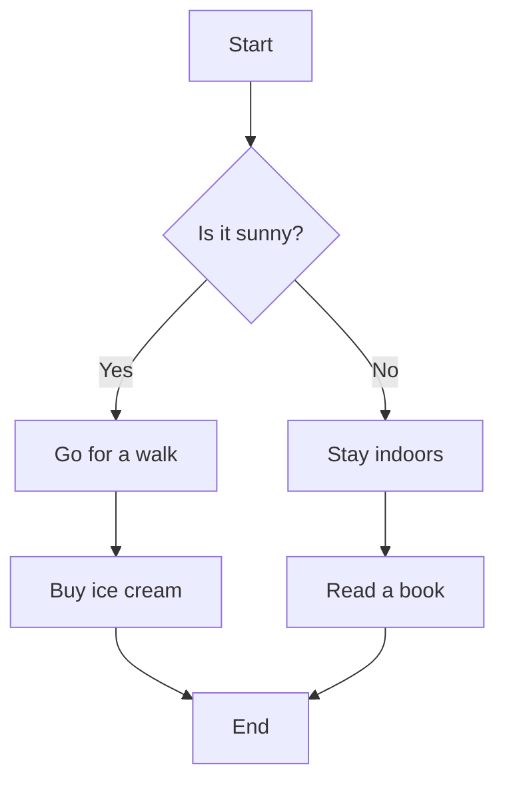

# Architecture

Here are some extra docs. With mermaid diagram support.

```mermaid
graph TD
    A[Start] --> B{Is it sunny?}
    B -->|Yes| C[Go for a walk]
    B -->|No| D[Stay indoors]
    C --> E[Buy ice cream]
    D --> F[Read a book]
    E --> G[End]
    F --> G

```
